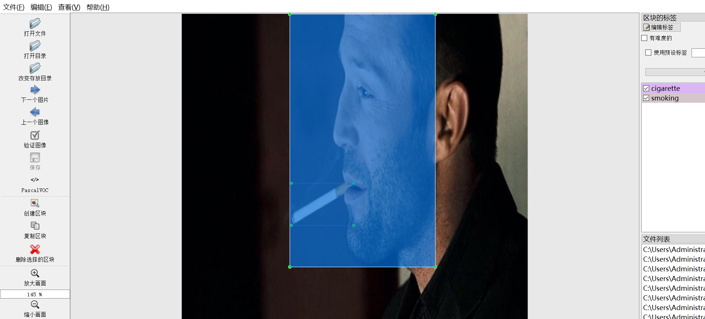
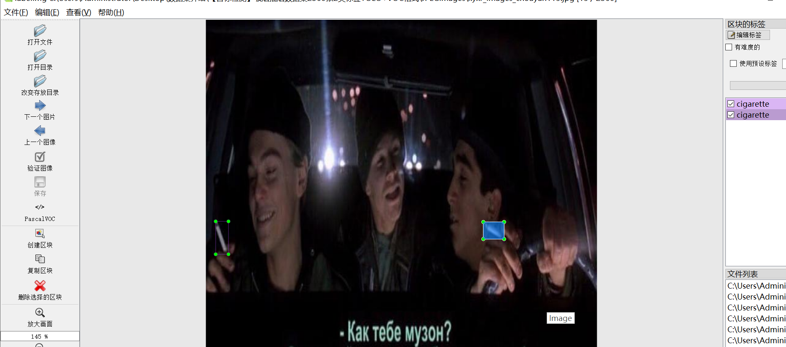
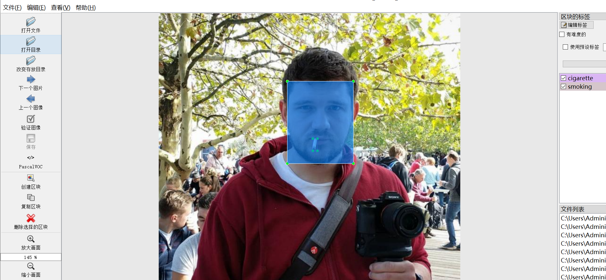
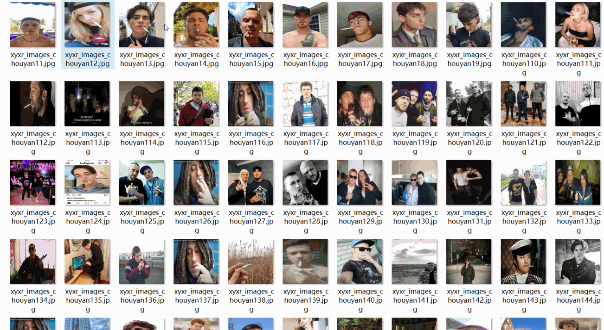

# [Object Detection] Smoking Dataset 2560 images2-classLabels YOLO+VOC format

Dataset Format: VOC format + YOLO format

The compressed file contains: three folders, each storing images, xml files, and text files.

Total jpg images in JPEGImages folder: 2560

The total number of XML files in the Annotations folder: 2560.

The total number of txt files in the labels folder is 2560.

Number of tag types: 2

Tag names: ["cigarette","smoking"]

The number of boxes for each label (Note that the order of labels in the Yolo format does not correspond to this, but is based on the classes.txt file in the labels folder):

cigarette frame count = 2688

smoking frame count = 1841

Total boxes: 4529

Picture clarity (Resolution: Pixels): Clear

Is the image enhanced: No

Shape of the label: Rectangular box, used for object detection and recognition.

Important Note: None

Special Notice: This dataset does not guarantee the accuracy or precision of the trained models or weight files. The dataset only provides accurate and reasonable annotations.

No specific annotation provided.

Picture overview

## Images

---

Here is a pay link on Stripe (https://buy.stripe.com/3cs8yP7sY87d0vu9AB). Please contact me lonlonago@foxmail.com after funding $89, and I will send you a complete data files, thank you!

